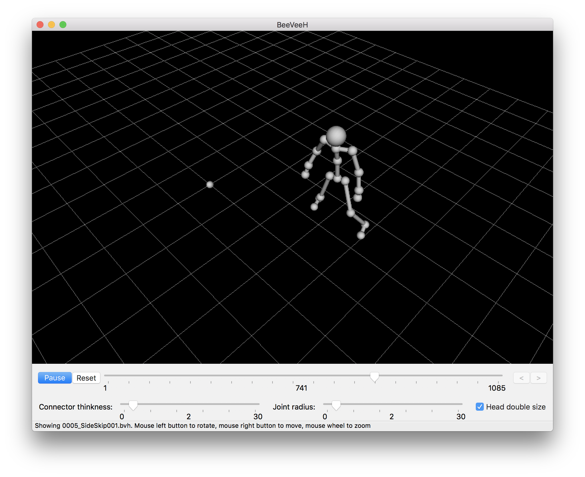

#  BeeVeeH - another BVH Player



## Development

### Requirements

- Python 3.x
- pip

If you are using macOS, you can skip this. If you are using Ubuntu, please do the following setups.

#### Ubuntu prerequisites

Install the following packages via `apt`:

- libwebkitgtk-dev
- libjpeg-dev
- libtiff-dev
- libgtk2.0-dev
- libsdl1.2-dev
- libgstreamer-plugins-base0.10-dev
- freeglut3
- freeglut3-dev
- libnotify-dev
- libsm-dev
- libgtk-3-dev
- libwebkitgtk-3.0-dev

### Setup


```sh
make init
```

### Test

```sh
make test
```

This will play a short sample BVH file. After completion, BeeVeeH will close automatically.

### Run

```sh
make run
```

This is the launch the main entry of BeeVeeH.

or,

```sh
make dist
```

This will generate the packed BeeVeeH inside the `./dist` directory.